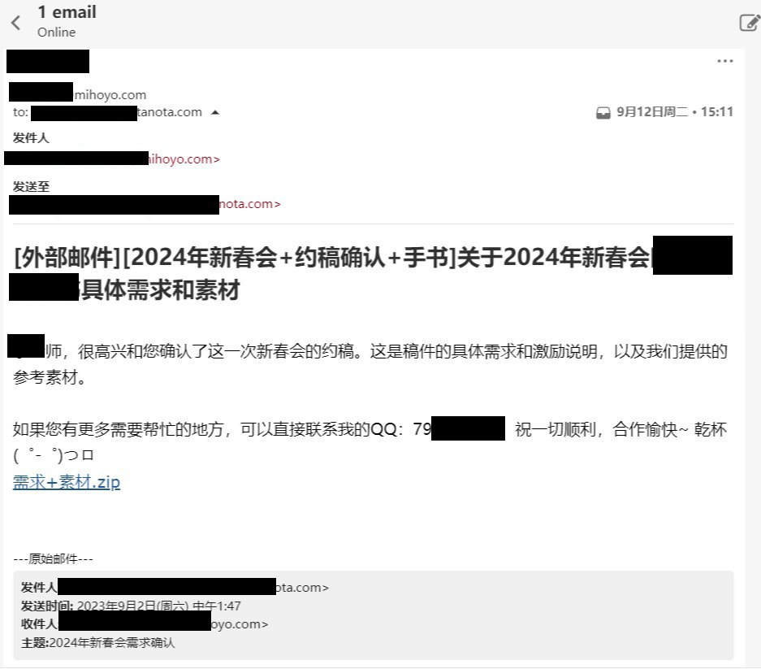

# 赠仙书（原名：给仙家军的一封信）
+ 原文转自关站后的[世界树.](https://hoyo.life/3.html)。注意：网站有盲水印。

+ 此处显示套有base64的原文及其转译版。

致仙家军们:

"You're throwing away happiness with both hands, and reaching out for something that will never make you happy."

“你用双手丢弃了幸福”“却伸向了永远不会让你幸福的东西”

NUxpTjU1K2w2WUdUNUwyZzVMdXM1cStQNWFTcDVhV0w1b2lZNVp5bzVZbU41N3EvNzd5TTZJTzk1b3UvNWFTYTViQ1I2TFdQNlllUjc3eU01cFMyNkk2MzVhU2E1YkNSNTUrbDZLK0c0NENDNXErUDVhU3A1NktNNTZLTTVwZWc1TGk2NVp5dzVZNjc1TGlBNUxpcTVZK0k1TGlBNUxpcTU2Uys1WXk2NG9DYzViZWg1NHlPNG9DZDc3eU01cFMyNkk2MzVibTI1cnVoNkxhejVMcUc2SWVxNWJleDRvQ2M1N3UwNW9xazRvQ2Q1N0d6NWE2MjU2Uys1WXk2NXJDYjVadTA1NXFFNkptYTZJMmo1YitENzd5TUlPVzV0dVdBbithdHBPbTZ1K2VYdWVpSHF1VzNzZW1BZyttQnYrZU9zT1d1bnVlYWhPV2tzZWkwcGVXU2pPV2dsZWlRdmVPQWdnPT0=

不知道你们每天奋战在前线，能拿多少赏金，收获多少知识。每天碌碌无为地去一个又一个社区“巡猎”，收获并满足了自己“维护”米家社区氛围的虚荣心， 并借此麻痹自己逃避现实的失败和堕落。

Nkl1bDVibXk1Ym0wNVpDTzc3eU01YjJUNUwyZzVhKzU1NTJBNloyaTZLK1Y1YTZZNXJ1VTVydVU1TGlONTd1ZDVaeXc1WStaNkwrdzZJZXE1YmV4NXB1KzU3dVA1TDJjNUxpNjRvQ2M1TGlBNUwyTjVZV0o2STJqNTVxRTVMdVo1YTYyNVlhYjRvQ2Q1WnlvNVpDRTVMaXE1NlMrNVl5NjVvcXI2STJHNXBhcDVxT1k3N3lNNWFXTDVMaU42YUcrNkxxcjU1cUU1N3VQNVk2Rzc3eU01WTIwNktLcjZaMmk2SytWNWE2WTVMaUE1TGlxNG9DYzZZS2o1TDJnNXB5SjVMdUE1TG1JNW9xQTZJTzlJT1dQcitTN3BlYTdvZWkycythSWtlUzdyT2VhaE9hTG0raUJtT21jZ09heGd1S0FuZWlBak9hRW4rV0lzT1d3dE9Xd3JPYVh0dSs4ak9TN3BlV1BpdW1kb3VpdmxlV3VtT2lFdU9TNGl1ZWFoT2VXa2VhRGtlV1NqT1M0amVXeGtlKzhqT1cvZytTNHJlUzRnT1d1bXVTOG11YURzK2kxdCttQ28rUzRxdVczcHVhSmkrYUx2K2VkZ09hSmkrYWN1dVdjcUVMbnE1bmlnSnpsdDZIbmpJN2lnSjN2dkl6bGo3UG1pWXZtbGJMbWlaUHBsSzdubTVqbG5Lam52cVRwaDR6bmxxL25pNExvdnBQbGg3cm5tb1RrdUl2bGpZampnSUk9

若干年后，当你对着面试官滔滔不绝地叙述自己曾经作为“一位光荣的仙家军”在各个社区披荆斩棘，奋不顾身的经历，却被面试官一个“那你有什么技能 可以满足我们的招聘需求”而感到尴尬时，以及面试官脸上的疑惑和不屑，心中一定会想起那个左手拿着手机在B站“巡猎”，右手敲打键盘在群里疯狂输出的下午。

NklDTTVwK1E1WWVnNUwyTjc3eU01Wkc4NVphSzVZV042TFM1NTVxRTVyQzA1WWFiNVk2NzVZaTM2TDJzNVkrUjc3eU01WWkzNXBLdDVwUys1NEs1NkxXZTc3eU01b3UvNTUyQTVMaU41WkNNNWJtejVZK3c1NXFFNVlpYjVMMmM1citBNVlxeDVvR3c1YjZYNmFXeDZhV3g0NENDNW9tQTZMQ1Q1NXFFNG9DYzU3dTA1b3FrNTZTKzVZeTY0b0NkNzd5TTVMdWw1WStLNG9DYzViZWg1NHlPNG9DZDc3eU02WU85NXBpdjVMdVc1THVzNTVxRTU1U2Y1b1NQNTcyaTVMcUc0NEND

而某几位，呼喊免费的水军去刷转发，刷播放点赞，拿着不同平台的创作激励恰得饱饱。所谓的“维护社区”，以及“巡猎”，都是他们的生意罢了。

NWFTbjZZT281WWlHNTVxRTVMdVo1YTYyNVlhYjZZTzk1cGl2NkllcTZLNms1TGk2NXB5SjZJZXE1YmV4NTVxRTZJU1I1YTJRNzd5TTZLNms1TGk2NW82bDVwUzI1NXFFNW9PRjVvcWw1YkN4NXBpdjVMcUw1YTZlNzd5TTVxK1A1TGlBNUwyTjVMdVo1YTYyNVlhYjZZTzk1cGl2NG9DYzZJZXE1b1MvNG9DZDZLR001WXFvNzd5TTVxK1A1TGlBNUwyTjVMdVo1YTYyNVlhYjZZTzk0b0NjNkllcTVvaVI1b0NkNklDRDRvQ2Q0NENDSU9pL21lYXRvK2FZcittQ28rV0hvT1M5amVtY2dPaW1nZWVhaE8rOGpPUzVuK2F0bytXYm9PV21ndWF0cE8rOGpPUzdsdVM3ck9TNGplbWNnT2ltZ2VhTGhlVzlrK1M3dStTOWxlaTBvK1M3dSsrOGpPV2JvT1M0dXVhdmorUzRnT1M0cXVTN21lV3V0dVdHbSttRHZlYVlyK1d1ak9XRnFPS0FuT2lIcXVhRXYrS0FuZWloak9XS3FPKzhqT0tBbk9pSHF1YUV2K0tBbmVXNXN1YTB1K09BZ2c9PQ==

大部分的仙家军都是自认为有自己的脑子，认为接收的情报就是事实，每一位仙家军都是“自愿”行动，每一位仙家军都“自我思考”。 这正是那几位需要的，也正因如此，他们不需要担当任何责任，因为每一个仙家军都是完全“自愿”行动，“自愿”干活。

Nks2azU1eWY1Wnl3NWIrZzVaR0s3N3lNNWEybTVMeWE1TGlBNUxpazVMaXE1b3FBNklPOTVvQzc1cStVNVp5bzU2Uys1WXk2NW8yajVMbXg1YVc5Nzd5TTU3eVc2TDZSNTd1RTU1cUU1TGlrNUwyTjVZbU41N3lXNkw2UjZaMmc1NTJBNkwrSDU2R3M1NXFFNTd1WTU1Uzc1b3FBNklPOTVvdS81WWl3NUxxRzVaV0c1WTJWNzd5TTViQ0c1ckNxNVlpdzVZNmY2WWVNNloyaTU1cUU2Wkt4NVlXbzZZT282SmFGNUxxRzVadWU1cDJsNDRDQ0lPaUFqT1M5b09TN3JPaS9tT2FZcitTNWllV0tvZWVVbXVpSHMrV0FrdWkwdE9hSmsrVzNwZU9BZ3VhZWdlZXJyK1M0Z09lQ3VlYWRwZWl2dE8rOGpPUzRsdWVWak9hZ2tlV0ZxT21kb09TN21lV3V0dVdHbStLQW5PV0Z1K2EwdStLQW5lZWRnT09BZ2c9PQ==

认真地忠告，学会一两个技能总比在社区捣乱好，编辑组的两位前编辑靠着过硬的绘画技能拿到了商单，将氪到原里面的钱全部薅了回来。 而你们还是义务甚至倒贴打工。极端一点来说，世界树全靠仙家军“养活”着。

NXB5SjVwZTI1WUNaNktlSjViNlg1THVaNWE2MjVZYWI1WktNNUxpQTVMcWI1cktKNllhSjVaeW81NlMrNVl5NjVZYXk2WlNMNlptMzZaaTE1NXFFNVkycjVZVzE1YjZJNVkrdjVvQ2M3N3lNNWFTeDVZNjc1THFHNTVTZjVyUzc3N3lNNVkrcTZJNjM1YjZYNUxxRzVMaUE1NG1INkptYTVwZWc1NXFFNklPYzVZaXA1b1NmNDRDQw==

有时候觉得仙家军和一些沉醉在社区冲锋陷阵的卫兵很可怜，失去了生活，只获得了一片虚无的胜利感。

S09hU3NPZW92K1M2dWpybnJvRGt1SzNrdTVucHFiRXA=

(撰稿人:简中仙驱)

TWpBeU0rVzV0REV5NXB5SU1qWG1sNlU9

2023年12月25日

附件1：

NW9TZjZMQ2k1cCtRNUxpSjVhMlg1WVdzNVkrNDVhKzU1TGlXNTVXTTVxQ1I1NXFFNW9XMzVvV282TFdlNVlxcDc3eUI=

感谢某三字公司对世界树的慷慨赞助！
（さようなら，再见）

> 网页注释：感谢你看到这里,祝您有个美好的一天——宇文拓 留